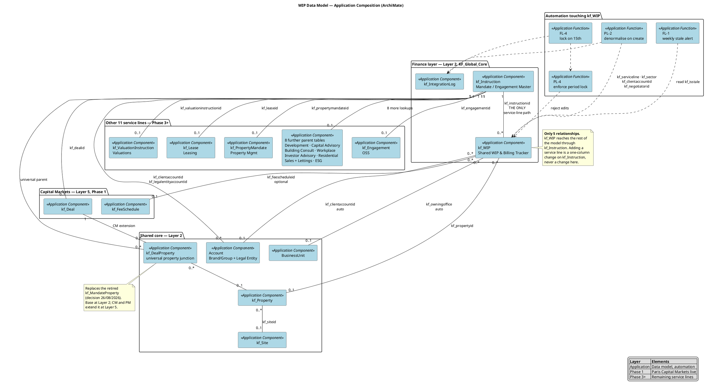

# WIP — Application Composition

The data model behind the WIP project. Shows the rule that matters most:
**`kf_WIP` has no service-line lookups.** All service-line context is reached
through `kf_Instruction`.

Supports [[wip-table-specification]] and [[wip-instruction-model]].

## Reading it

- **The single path.** `kf_Instruction → kf_WIP` is the only route to a
  service-line record. Everything on the right of the diagram hangs off
  `kf_Instruction`, not off `kf_WIP`.
- **Denormalisation.** `kf_clientaccountid`, `kf_owningoffice`, `kf_serviceline`,
  `kf_sector` and `kf_negotiatorid` are copied onto WIP by PL-2 so finance can
  report without joins. If PL-2 is wrong, WIP reporting diverges from the CRM of
  record silently — the fields are auto and read-only.
- **Property reach.** `kf_WIP.kf_propertyid` holds one property. Portfolio work goes
  `kf_Instruction → kf_DealProperty → kf_Property`. Fee granularity is the
  Instruction; the property link is presentational.
- **Optional fee link.** `kf_feescheduleid` is optional and `kf_FeeSchedule` is
  Capital Markets only, so the other eleven service lines key fee amounts directly.

## Known gaps visible here

- No element carries the ERP cross-reference. Q1 in [[wip-open-questions]] — the
  authoritative `kf_WIP` definition drops `kf_fin_localsystemref`, yet the
  required-at-Billed rule needs it.
- The service-line grouping is 13 lookups, but the reporting choice set
  `kf_globalchoice_serviceline` has 14 values that do not match the 12 sheets
  (Q11).

---

Related: [[wip-archimate-index]] · [[wip-lifecycle]] · [[wip-system-landscape]]
