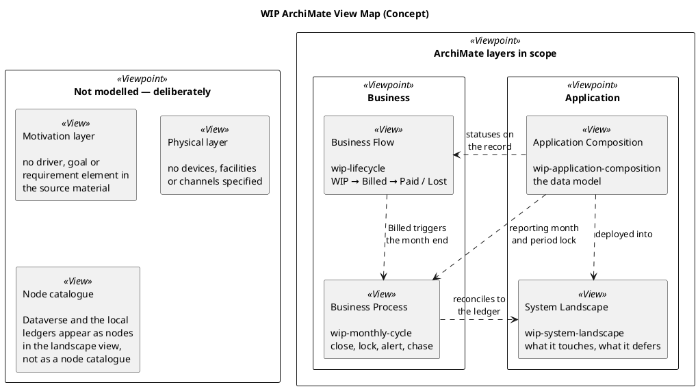

# WIP — ArchiMate Index

Navigation for the WIP model set, and an honest account of which ArchiMate layers
are covered.

## The four views

## The views

| View | Note | ArchiMate layer | Answers |
| --- | --- | --- | --- |
| Application Composition | [[wip-application-composition]] | Application | What tables exist and how they relate |
| Business Flow | [[wip-lifecycle]] | Business | What the WIP status ladder requires |
| Business Process | [[wip-monthly-cycle]] | Business | How a month is closed, locked and chased |
| System Landscape | [[wip-system-landscape]] | Application + Technology | What WIP touches now, and what it defers to Phase 7 |

## Reading order

1. **[[wip-project-overview]]** — the scope and the single-path rule
2. **[[wip-application-composition]]** — the data model
3. **[[wip-lifecycle]]** — what each status transition demands
4. **[[wip-monthly-cycle]]** — the operating rhythm
5. **[[wip-system-landscape]]** — the boundaries and the deferrals

Then the detail notes: [[wip-table-specification]] · [[wip-instruction-model]] ·
[[wip-automation-requirements]] · [[wip-period-locking-and-aging]] ·
[[wip-finance-erp-integration]] · [[wip-stage-gates]] ·
[[wip-reporting-and-kpis]] · [[wip-rollout-plan]] · [[wip-crm-dependencies]] ·
[[wip-taxonomy-inputs]] · [[wip-open-questions]] · [[wip-delivery-backlog]]

## What is deliberately not modelled

**Motivation layer.** The source workbooks are data-model specifications. They
contain no drivers, goals, outcomes or requirements elements, so there is nothing to
lift into ArchiMate's motivation view. The closest equivalent — the reason WIP
exists — is captured in [[wip-project-overview]] as prose: it replaces the
SharePoint WIP & Billed template on a hard cutover.

**Physical layer.** No devices, facilities or physical channels are specified.
Buildings appear only as `kf_Site` records, which is a data entity, not a physical
element.

**A node catalogue.** Dataverse, Paris GL, Madrid Accounting, SAP, SharePoint,
Loqate, KYC providers and the Hub appear in [[wip-system-landscape]] as nodes
because their boundaries matter to the WIP project. They are not a deployment
inventory.

## Conventions

- Element colour follows the ArchiMate layer convention — blue for Application,
  light blue for Business, slate for Technology.
- **No stdlib dependency.** Every element is declared inline as
  `rectangle "label" as id <<Stereotype>> #colour` rather than through
  `!include <archimate/Archimate-Element>`. The macros such as
  `Application_Component` are PlantUML keywords supplied by the ArchiMate stdlib,
  which not every PlantUML host has installed. Declaring the stereotype directly is
  slightly more verbose but renders anywhere. Do not reintroduce the stdlib include
  or macro forms.
- Preprocessor macros are avoided for the same reason. A `!define` factory that
  expands to an element declaration only honours its `as` alias on the first
  expansion, so `Application_Component(a, "x")` followed by
  `Application_Component(b, "y")` is a syntax error. `!definelong` is not a reliable
  workaround. Write the elements out.
- `Business Event` uses `circle`, not `ellipse` — `ellipse` is not a valid PlantUML
  element keyword and fails to parse.
- This view map uses the ArchiMate `<<Viewpoint>>` and `<<View>>` stereotypes rather
  than layer elements. A viewpoint groups views by ArchiMate layer; a view is the
  note that documents one. Layer elements such as `Application_Component` are reserved
  for the four model views, where they carry real meaning.
- Solid line `--` is an **association** (a structural link between data entities).
- Dashed arrow `..>` is a **serving** relationship (something used by, or
  supporting, something else).
- Solid arrow `-->` is a **flow** or **triggering** relationship in the business
  views.
- Multiplicity on the data model views is Dataverse cardinality: `1` to `0..*`.
- `note` blocks carry spec gaps and unresolved decisions, not decoration. Every one
  of them traces to a numbered item in [[wip-open-questions]].
