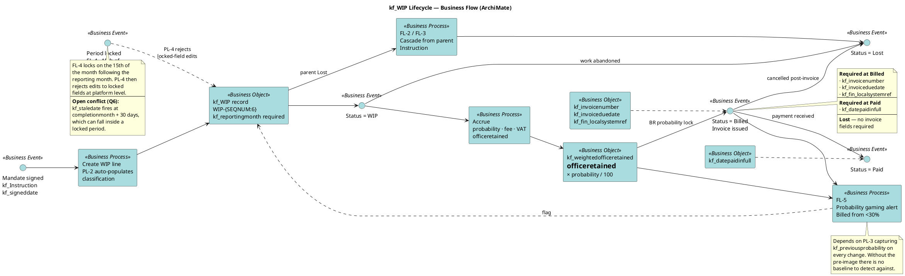

# WIP — Lifecycle

The `kf_wipstatus` choice set: **WIP → Billed → Paid**, with **Lost** reachable
from either side. Each transition carries a mandatory field set — that is the whole
of the billing control.

Supports [[wip-table-specification]] and [[wip-automation-requirements]].

## The ladder

| From | Event | Mandatory fields | Automation |
| --- | --- | --- | --- |
| — | Mandate signed | `kf_Instruction.kf_signeddate`, active status | PL-1, PL-2 |
| WIP | Invoice issued | `kf_invoicenumber`, `kf_invoiceduedate`, `kf_fin_localsystemref` | BR invoice field requirements, BR probability lock |
| Billed | Payment received | `kf_datepaidinfull` | — |
| WIP or Billed | Parent lost / withdrawn | none | FL-2, FL-3 cascade |
| any | Period lock | — | FL-4, PL-4 |

`kf_invoicenumber` is required at **both** Billed and Paid — it is never cleared once
set.

## The control that protects it

FL-5 flags any line billed from a probability below 30%. That is the only quantified
control threshold in the whole WIP specification, and it exists because
`kf_weightedofficeretained` is the pipeline figure finance reports on. Billing a line
that was parked at a low probability inflates nothing but conceals a deal that was
never probable.

## Blocking gap

The **Billed** transition is the one that breaks. The authoritative `kf_WIP`
definition has no `kf_fin_localsystemref` field, so the required-at-Billed rule has
nowhere to write. This is Q1 in [[wip-open-questions]] and it must be settled before
this flow can be implemented.

---

Related: [[wip-archimate-index]] · [[wip-application-composition]] · [[wip-monthly-cycle]]
