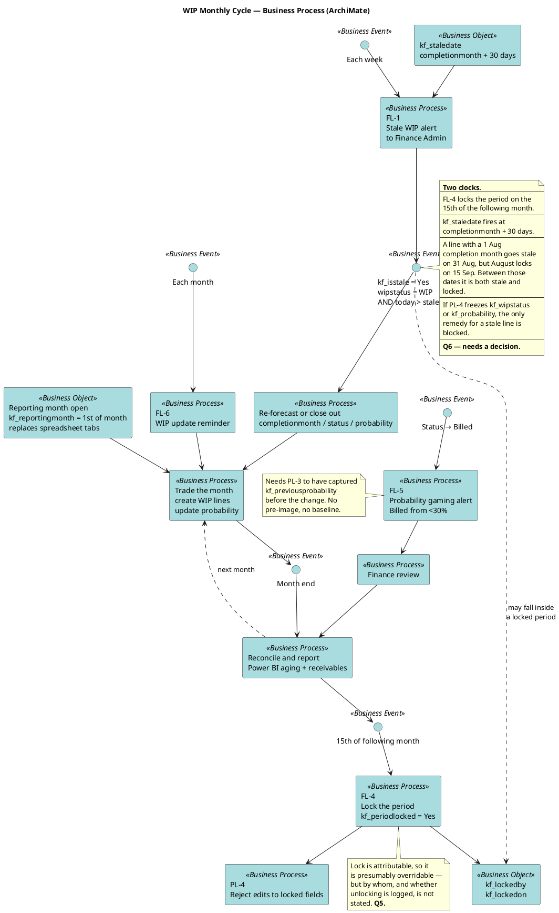

# WIP — Monthly Cycle

The discipline mechanism that replaces the SharePoint spreadsheet. The spreadsheet
was self-enforcing — you had to open the right month's tab. These flows have to
supply that pressure externally.

Supports [[wip-period-locking-and-aging]] and [[wip-automation-requirements]].

## The three cadences

| Cadence | ID | Trigger | Target |
| --- | --- | --- | --- |
| Weekly | FL-1 | Schedule | Finance Admin, on `kf_isstale` |
| Monthly | FL-4 | 15th of following month | Sets `kf_periodlocked` |
| Monthly | FL-6 | Schedule | Negotiators |
| On event | FL-5 | Status → Billed | Finance review |
| On event | PL-4 | Any write | Rejects locked-field edits |

## Why FL-1 and FL-6 are both needed

FL-1 is an **alert** — it tells finance a line has overrun its own forecast by more
than 30 days. FL-6 is a **reminder** — it tells the negotiator to update. The
spreadsheet achieved both at once because the tab changed. Now they are separate
flows pointing at different people, which is why both are specified.

## The unresolved collision

This is the diagram's real content. FL-4 and `kf_staledate` run on different clocks
and the source never reconciles them. Three ways out, none chosen:

1. Exclude `kf_completionmonth` from the locked field set, so a stale line can be
   re-forecast.
2. Allow status and probability edits on stale lines even in a locked period.
3. Move the lock to align with the staleness threshold.

Q6 in [[wip-open-questions]]. It needs a finance answer, not a modelling one.

---

Related: [[wip-archimate-index]] · [[wip-lifecycle]] · [[wip-reporting-and-kpis]]
