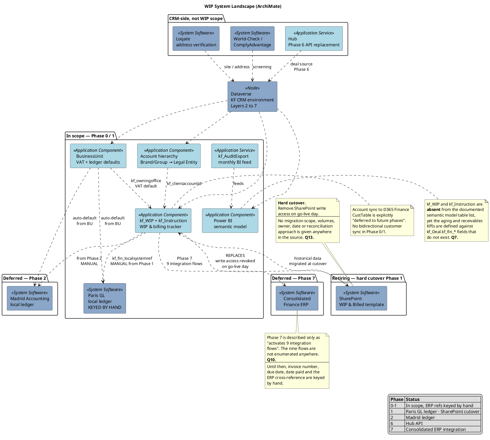

# WIP — System Landscape

What the WIP project actually touches, and — more importantly — what it does not
touch yet. The gap between the finance tables and the finance systems is the whole
story of Phases 0 to 7.

Supports [[wip-rollout-plan]] and [[wip-finance-erp-integration]].

## What this makes obvious

**WIP ships before it is integrated.** The table is live in Phase 0, Paris deals
bill from Phase 1, and the consolidated ERP does not arrive until Phase 7. The
`kf_fin_*` fields exist from day one precisely so the interim join key is already in
place when the integration lands.

**The cutover is the only irreversible item.** Everything else can be deferred,
re-scoped or re-run. Revoking SharePoint write access on go-live day cannot, which
makes the unmigrated-data risk the single largest unowned risk in the WIP scope.

**The reporting layer is currently unowned.** `kf_WIP` and `kf_Instruction` are not
in the semantic model, and two of the seven standard KPIs point at fields that do not
exist. WIP reporting is specified but assigned to nobody.

## Out of the WIP lane

Loqate, KYC screening and the Hub are shown for context only. They touch the CRM
tables, never `kf_WIP` or `kf_Instruction`. See [[wip-crm-dependencies]] for exactly
what WIP consumes.

---

Related: [[wip-archimate-index]] · [[wip-application-composition]] · [[wip-rollout-plan]]
