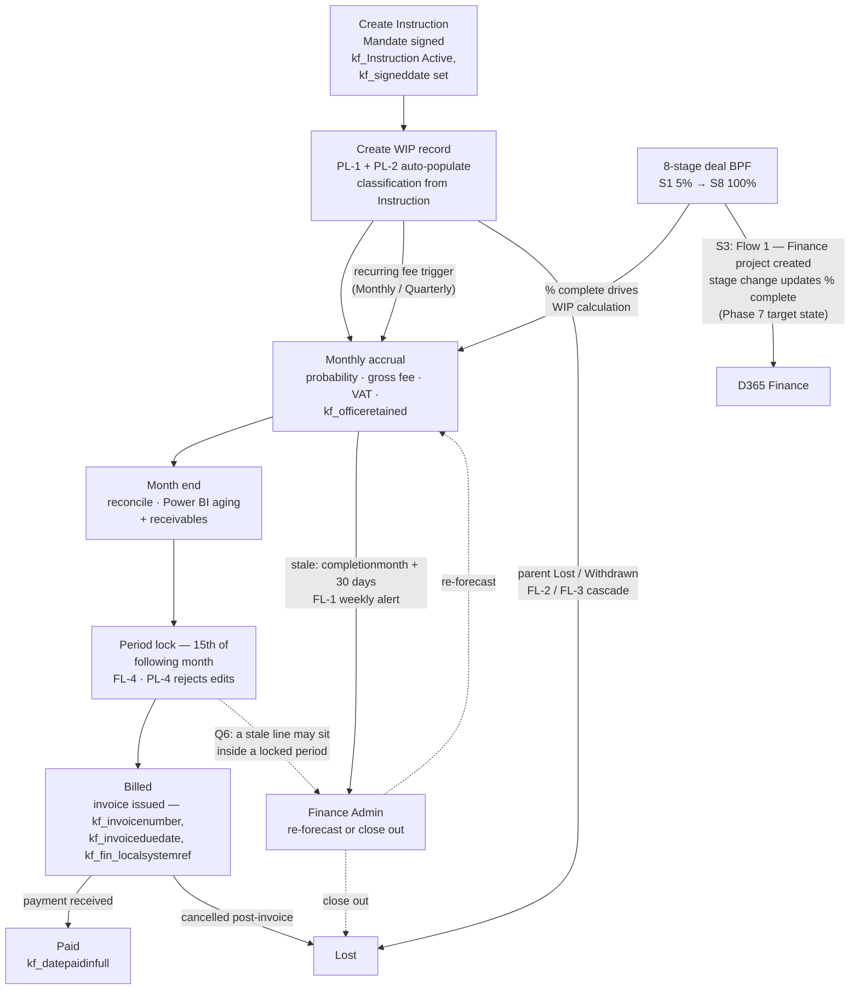

# WIP — High-Level Workflow

The end-to-end journey of a fee-earning instruction: how a signed mandate becomes a
WIP line, accrues month by month, gets billed, is paid or lost — and how the monthly
operating rhythm reconciles, locks and chases it. Combines the workbook (tables and
rules) with the architecture review deck (the BPF → % complete drive and the
integration flows).

> Looking for the plain-English version? Go to [[wip-simple-workflow]].

Two records carry the workflow: the **deal** runs the 8-stage BPF in CRM; the
**`kf_WIP` line** runs the finance ladder **WIP → Billed → Paid / Lost** under its
parent `kf_Instruction`.

## At a glance

## The journey, stage by stage

| Stage | Trigger | What happens | Controls |
| --- | --- | --- | --- |
| Instruction Active | Mandate signed (`kf_signeddate`) | `kf_Instruction` opened with `kf_instructionstatus = Active`; `kf_legalentityaccountid` must exist by Mandate (S3) | WIP entry gate: Active + signed date ([[wip-stage-gates]], inferred) |
| Create WIP record | Instruction created, or recurring fee trigger | PL-2 auto-populates classification from the parent; `kf_reportingmonth` = 1st of month | PL-1 parent validation — now single-parent, see Q2 |
| Monthly accrual | Each month | Probability, `kf_grossfee`, VAT (BU default: FR 20 / ES 21 / UK 20), `kf_officeretained` | `kf_weightedofficeretained = officeretained × probability / 100`; FL-6 reminder to negotiators |
| Reconciliation | Month end | Power BI aging + receivables refresh | — |
| Period lock | 15th of following month | `kf_periodlocked = Yes`; locked-field edits rejected | FL-4, PL-4 — locked field set unstated, Q5 |
| Billed | Invoice issued | `kf_invoicenumber`, `kf_invoiceduedate`, `kf_fin_localsystemref` required | FL-5 flags billing from < 30% probability → finance review |
| Paid | Payment received | `kf_datepaidinfull` set | — |
| Lost | Work abandoned / parent lost / cancelled post-invoice | No invoice fields required | FL-2 / FL-3 cascade from parent |

`kf_invoicenumber` is required at both Billed and Paid — never cleared once set.

## Two clocks drive the movement

| Clock | Where it lives | What it does |
| --- | --- | --- |
| `kf_wipstatus` ladder | The WIP record | Finance control — mandatory field set per transition |
| 8-stage deal BPF | The CRM deal | Maps stage → finance % complete, which *"automates the WIP calculation"* (deck) |

The BPF clock is the newer drive, from the architecture review: each deal stage
maps to a percentage (S1 5% → S8 100%), a monthly batch refreshes WIP balance and
ageing, and deal-won raises a draft invoice request. Until Phase 7 the finance
side is manual — see [[wip-finance-erp-integration]].

> [!warning] Stage-name discrepancy between sources
> The workbook BPF ([[wip-stage-gates]]) is Origination → Pitch → Mandate →
> Marketing → Bidding → DD → Exchange → Completion. The deck uses S1 Origination,
> S2 Pitch & Mandate, S3 Instruction, S4 Marketing, S5 Bidding, S6 Exclusivity,
> S7 Due Diligence, S8 Completion. Functional shape matches; names and ordering
> (`Instruction` stage, `Exclusivity` vs `Exchange`) do not. Worth reconciling
> before gates are registered against stage names.

## The monthly drumbeat

| Cadence | ID | Trigger | Target |
| --- | --- | --- | --- |
| Weekly | FL-1 | Stale line (`completionmonth + 30 days`) | Finance Admin — re-forecast or close out |
| Monthly | FL-6 | Schedule | Negotiators — update the WIP |
| Month end | — | Schedule | Reconcile, Power BI |
| Monthly | FL-4 | 15th of following month | Lock the period |
| On event | PL-4 | Any write | Reject locked-field edits |
| On event | FL-5 | Status → Billed | Finance review if probability < 30% |

Full dynamics in [[wip-monthly-cycle]].

## Phase 7 target state — the integration flows

The deck is the first source to put shape on the nine Phase 7 flows (Q10). Six
behaviours are named:

| # | Flow behaviour |
| --- | --- |
| 1 | **Flow 1** — S3 fires creation of the Finance project |
| 2 | Each stage change updates % complete in Finance |
| 3 | Deal won raises a draft invoice request |
| 4 | Invoice and payment data returns within hours |
| 5 | A monthly batch refreshes WIP balance and ageing |
| 6 | A credit hold alerts the broker in Teams |

The CRM → Finance mapping behind them: `kf_WIP` line ↔ project, `kf_FeeSchedule` ↔
project budget/contract line, BPF stage ↔ % complete, Won ↔ milestone/invoice
request, Account ↔ customer (debtor).

Still open: the canonical list of nine, and reconciling *"Manual (Finance Admin)"*
in MVP against the D365 flows the deck describes in the present tense. See
[[wip-open-questions]] Q10.

## Where the workflow is currently blocked

| Question | Effect on the workflow |
| --- | --- |
| Q1 | The Billed transition demands `kf_fin_localsystemref`, but the authoritative `kf_WIP` spec has no such field. The deck keeps the field — decision still open. |
| Q2 | PL-1 / PL-2 / FL-2 / FL-3 were written for a 13-lookup parent that no longer exists; the create and cascade steps depend on their restatement. |
| Q6 | A stale line can sit inside a locked period, blocking the standard remedy (re-forecast or close out). |
| Q9 | Whether the entry/billing gates are `kf_StageGateRule` rows or plain business rules — the deck fires all gates on the deal BPF, not on WIP. |

## Related

- [[wip-project-overview]] — scope and the single-parent rule
- [[wip-lifecycle]] — the WIP → Billed → Paid / Lost ladder
- [[wip-monthly-cycle]] — close, lock, alert, chase
- [[wip-automation-requirements]] — PL-1…4, FL-1…6, BR-1…6, DD-1
- [[wip-finance-erp-integration]] — invoice fields, VAT, ERP deferral
- [[wip-stage-gates]] — gating WIP entry
- [[wip-open-questions]] — the contradictions, unresolved