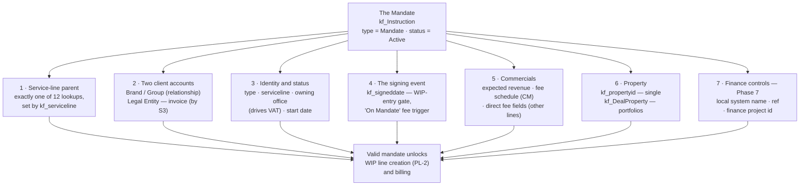

# Mandate — Required Components

What a mandate is, and what must exist for one to be valid.

The **mandate** is the signed agreement that authorises fee-earning work. The source
uses the word in two senses, and both matter to WIP:

| Sense | Where | Meaning |
| --- | --- | --- |
| **Type** | `kf_Instruction.kf_instructiontype = Mandate` | The finance record that WIP hangs off (the other types: Engagement, Instruction) |
| **Stage** | CM deal BPF, S3 | The point in the deal lifecycle where the mandate is won (workbook: S3 "Mandate"; deck: S2 "Pitch & Mandate" → S3 "Instruction") |

This page covers the type. A mandate record that is missing any "Required" component
below is a build error, not a data gap.

## At a glance

The same seven components, as a picture:

## 1. A service-line parent — required

Exactly one parent lookup populated, determined by `kf_serviceline`. For Capital
Markets the parent is the deal — the mandate can only be signed once the deal has
reached S3.

| `kf_serviceline` | Parent lookup | `kf_serviceline` | Parent lookup |
| --- | --- | --- | --- |
| Capital Markets | `kf_dealid` | Development | `kf_developmentprojectid` |
| OSS | `kf_engagementid` | Capital Advisory | `kf_debtmandateid` |
| Valuations | `kf_valuationinstructionid` | Building Consultancy | `kf_buildingsurveyid` |
| Leasing | `kf_leaseid` | Workplace | `kf_workplaceassessmentid` |
| Property Management | `kf_propertymandateid` | Investor Advisory | `kf_investormandateid` |
| ESG Consultancy | `kf_esgassessmentid` | Residential Sales | `kf_salesinstructionid` |

Residential Lettings is the only service line with no parent of its own
(`kf_lettingsinstructionid` is defined but has no target table in the source).

## 2. The two client accounts — required

The mandate splits "who we work for" from "who we invoice":

- **`kf_clientaccountid`** — the Brand/Group account (relationship owner). Required.
  Drives cross-sell and relationship reporting.
- **`kf_legalentityaccountid`** — the Legal Entity (SPV, fund, JV) that is the
  contractual party. **Must exist by the Mandate stage (S3)**; it is *"the entity on
  the fee letter and invoice"*. Filtered to `kf_accountclassification = Legal Entity`.

Without the second one, the mandate can be won but never billed.

## 3. Identity and status — required

| Component | Value | Why it's there |
| --- | --- | --- |
| `kf_instructiontype` | `Mandate` | Subtypes the record — the other options (Engagement, Instruction) create different beasts |
| `kf_serviceline` | one of the twelve | Picks the parent lookup (component 1) |
| `kf_instructionstatus` | `Active` | WIP entry is gated on Active; Completed / On Hold / Withdrawn mandates do not generate WIP |
| `kf_owningoffice` | Business Unit | Security scoping — and it inherits the VAT default (FR 20 / ES 21 / UK 20) |
| `kf_startdate` | Date | When the instructed work begins |

## 4. The signing event

- **`kf_signeddate`** — the day the client signed. Not a hard-required field in the
  spec, but it is the **gate for WIP entry** (Active status + signed date), and it is
  the trigger reference for fee schedules set to *On Mandate*.
- `kf_name` is auto-generated (`INS-{SEQNUM:6}`), so identity never waits on a human.

## 5. Commercials

| Component | Requirement |
| --- | --- |
| `kf_expectedrevenue` | Optional — expected revenue at signing |
| `kf_FeeSchedule` link | CM only. A fee schedule with `kf_triggerpoint` = **On Mandate** locks the fee basis (Fixed / % of Value / Tiered / Hourly), amounts, minimums and caps, and `kf_invoiceduedays` terms |
| Direct fee fields | The other eleven service lines have no fee schedule table — their fees sit on the WIP line itself (`kf_grossfee` / `kf_netfeetogroup` / `kf_officeretained`) |

## 6. Property

- **`kf_propertyid`** — optional single-property reference on the instruction.
- **`kf_DealProperty`** — the universal junction (retired `kf_MandateProperty`,
  merged 26/08/2026) for portfolio mandates: one mandate, many properties, one line
  each with allocation and status.

## 7. Finance controls

Carried on the mandate from day one, but only exercised at Phase 7 (ERP):

| Component | Purpose |
| --- | --- |
| `kf_fin_localsystemname` | Paris GL / Madrid Accounting / SAP / Other — the ledger the mandate books to |
| `kf_fin_localsystemref` | ERP cross-reference — the join key back to the ledger |
| `kf_fin_projectid` | D365 Finance project ID (populated by the integration at S3, Phase 7) |

## What the mandate unlocks

- **A WIP line** — PL-2 auto-populates the classification fields from the
  instruction when the first WIP record is created. No mandate, no WIP.
- **Billing** — the invoice entity (`kf_legalentityaccountid`) and the fee basis
  both come from components above.
- Step 1 of [[wip-simple-workflow]] is precisely this record.

## Open conflicts affecting the mandate

| Question | Effect |
| --- | --- |
| Q3 | Two `kf_Instruction` specs exist. The Core version (used here) drops `kf_sector`, `kf_currency`, `kf_negotiatorid`; if those are wanted on a mandate they must be added back. |
| Q9 | The WIP-entry gate (mandate Active + signed before WIP) is **inferred**, not in the source. |
| Stage naming | Workbook calls S3 "Mandate", the deck calls S3 "Instruction" — reconcile before gate rules are registered against stage names. |

## Related

- [[wip-instruction-model]] — the full instruction spec and the 13-lookup parent rule
- [[wip-stage-gates]] — the inferred mandate gate
- [[wip-finance-erp-integration]] — fee schedule, VAT, ERP deferral
- [[wip-high-level-workflow]] / [[wip-simple-workflow]] — where the mandate sits in the flow