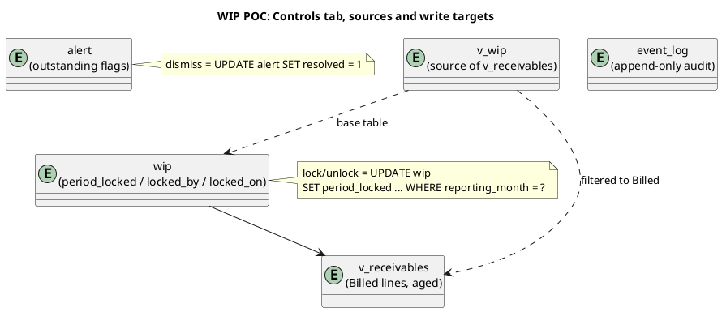

# WIP POC, Controls tab

The **Controls** tab is the governance view. It gathers the four things finance and operations act on but that do not belong on the WIP list itself: outstanding alerts, aged receivables, reporting-period locks, and the recent event trail. `SidePanels.svelte` renders all four as stacked panels.

This page documents what the tab shows, the tables and views behind it, and the queries and commands that drive it.

## What the tab shows

Four panels, top to bottom.

**Alerts.** Every row in `alert`, ordered by severity (High, then Medium, then the rest) and newest first. Each card shows the alert type, the WIP line it points at, the message, and the raised date. A dismiss button marks the alert resolved. In the seed, an unresolved `Stale WIP` alert reads off the same staleness the WIP tab flags.

**Receivables.** Two parts. A bucket summary groups the open Billed lines into ageing buckets (`0-30`, `31-60`, `61-90`, `90+`) with a line count and gross total per bucket. Below it, the individual open invoices list by days overdue, each showing the brand, invoice number, due date, days overdue, and the gross value including VAT.

**Reporting periods.** One row per `reporting_month` with the line count, how many lines are locked, and the weighted value. Each row carries a lock or unlock action. Locking stamps every line in that month; unlocking reverses it. Locked lines are what the `LOCKED` flag on the WIP tab reflects, and the period-lock trigger refuses further edits.

**Recent events.** The last 40 rows of `event_log`, newest first. This is an append-only audit trail written by the database triggers, not by any button.

## Data structure

The tab reads one base table (`alert`), one audit table (`event_log`), and one view (`v_receivables`). Its only writes are a dismissed-alert flag and the period-lock columns on `wip`.



`v_receivables` is defined in `schema.js` as the Billed subset of `v_wip`, with two computed columns: `gross_incl_vat` (`gross_fee * (1 + vat_percent / 100)`) and `days_overdue` (`julianday('now') - julianday(invoice_due_date)`). The bucket is a `CASE` over `days_overdue` at the 30, 60, and 90 day boundaries. The view carries a comment noting that the source KPI is defined against a `kf_fin_outstanding` field that does not exist (open question Q7), so this derivation is the inferred substitute.

| Panel | Source | Write |
| --- | --- | --- |
| Alerts | `alert` | `resolved` flag |
| Receivables buckets | `v_receivables` grouped by `bucket` | none |
| Receivables list | `v_receivables` | none |
| Reporting periods | `wip` grouped by `reporting_month` | `period_locked`, `locked_by`, `locked_on` |
| Recent events | `event_log` | none (triggers write here) |

## Queries and commands

All of the following live in `POC/wip-poc/src/lib/repo.js`.

**`getAlerts()`.** Severity ordering is done with a `CASE` so High floats to the top regardless of insert order.

```sql
SELECT * FROM alert
 ORDER BY CASE severity WHEN 'High' THEN 0 WHEN 'Medium' THEN 1 ELSE 2 END, id DESC
```

**`dismissAlert(id)`.** Resolves one alert.

```sql
UPDATE alert SET resolved = 1 WHERE id = ?
```

**`getReceivableBuckets()`.** The ageing summary.

```sql
SELECT bucket,
       count(*)                      AS lines,
       round(sum(gross_incl_vat), 2) AS total
  FROM v_receivables
 GROUP BY bucket
 ORDER BY bucket
```

**`getReceivables()`.** The per-invoice list.

```sql
SELECT * FROM v_receivables ORDER BY days_overdue DESC
```

**`getPeriods()`.** One row per reporting month, with the weighted value summed over the base `wip` table.

```sql
SELECT reporting_month,
       count(*)                             AS lines,
       sum(period_locked)                   AS locked,
       sum(gross_fee * probability / 100.0) AS weighted
  FROM wip
 GROUP BY reporting_month
 ORDER BY reporting_month DESC
```

**`lockPeriod(month, user)`** and **`unlockPeriod(month, user)`.** Toggle the lock for every line in a month. Both stamp who locked it and when.

```sql
UPDATE wip SET period_locked = 1, locked_by = ?, locked_on = datetime('now')
 WHERE reporting_month = ?
```

Unlock is the same statement with `period_locked = 0`. Once a month is locked, the period-lock trigger rejects later edits to those lines, so this panel is the gate on historical changes.

**`getEvents(limit)`.** The audit tail; the panel calls it with a limit of 40.

```sql
SELECT * FROM event_log ORDER BY id DESC LIMIT ?
```

### Discrepancy to verify

The events list renders each row's timestamp as `e.event_time?.slice(5, 16)`, but `getEvents` selects from `event_log`, whose timestamp column is named `logged_on`, not `event_time`. On the current schema that expression reads `undefined`, so the "When" column renders blank. Either the column was renamed at some point or the component was written against an older shape. Logged here rather than guessed; worth a one-line fix in the component or the query alias.

## Where it lives

| Panel | Component | Repo command |
| --- | --- | --- |
| Alerts | `SidePanels.svelte` | `getAlerts`, `dismissAlert` |
| Receivables | `SidePanels.svelte` | `getReceivableBuckets`, `getReceivables` |
| Reporting periods | `SidePanels.svelte` | `getPeriods`, `lockPeriod`, `unlockPeriod` |
| Recent events | `SidePanels.svelte` | `getEvents` |

## Related

- [[dashboard]], whose locked-lines and stale counts come from the same `wip` columns.
- [[wip]], where the `LOCKED` and `STALE` flags are shown per line.
- [[wip-automation-requirements]], the triggers that write `event_log` and enforce the period lock.
- [[wip-open-questions]], including Q7 on the receivables KPI source.
