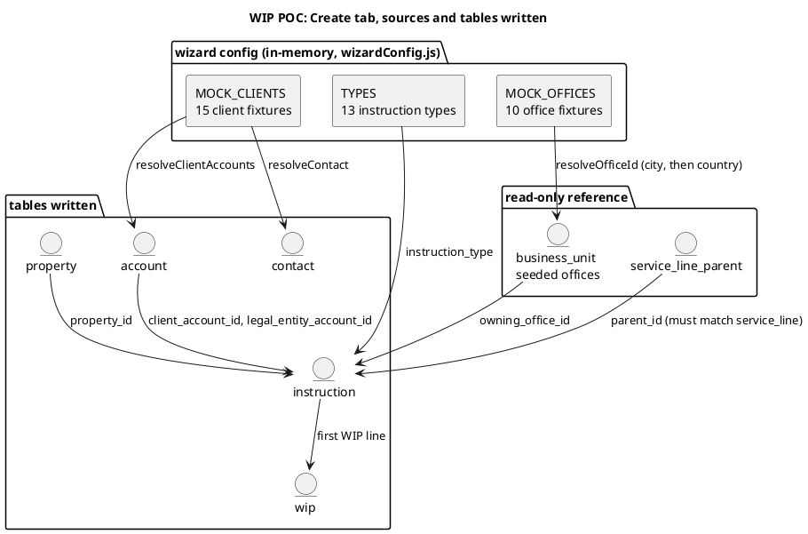

# WIP POC, Create tab

The **Create** tab is the app's only write path for new work. It is a five-step wizard that collects everything needed to open an instruction and, on accept, writes an Instruction row plus its first WIP line. `CreatePanel.svelte` is a thin wrapper around `InstructionWizard.svelte`; the wizard holds all of the step state, validation, and the accept handler.

This page documents what the tab shows, the tables it writes, and the commands behind them. See [[dashboard]] for the read side of the same data.

## What the tab shows

The wizard is one screen with a step header and a fixed footer. The footer carries `Back`, `Cancel`, and a `Next` / `Accept` button that stays disabled until the current step is valid.

**Step 1, Type.** A grid of the 13 instruction types from `TYPES`. Each type carries its `entity` (Instruction or Valuation) and `serviceLine`. Picking a type sets both and drives every later step.

**Step 2, Client.** A searchable mock client directory (15 entries) plus the client fields: client name, legal entity, contact name. The search box filters the fixture list; picking a result fills the name and legal entity.

**Step 3, Property.** Address capture with the Loqate typeahead. Choosing a country and typing into the address field calls Loqate Find; picking a suggestion calls Loqate Verify and maps the structured result onto address, city, and postcode. A title, tenure, and sector are captured here too. This is the only step that makes a network call.

**Step 4, Details.** The type-specific fields for the chosen type (each `TYPES` entry lists its own `fields` and `dateField`). Only the selected type's fields render. Weekly rent entries recalculate a monthly and annual figure as you type.

**Step 5, Terms.** The commercial terms: fee basis and amount, currency (defaulted from the selected office), expected revenue, target completion, the assigned negotiator, the owning office, and free-text notes. The owning office selection then filters the negotiator list.

**Review.** A readiness checklist that lists what is still missing. `Accept` stays disabled until every check passes. On accept the wizard builds an immutable payload snapshot (shown as JSON) so the created record matches exactly what was reviewed.

## Data structure

The wizard keeps no tables of its own. It reads two fixtures in memory and writes five tables through the repo. Offices are resolved, not created, because `business_unit` is seeded.



| Table | Written by | Key fields set from the wizard |
| --- | --- | --- |
| `account` | `resolveClientAccounts`, `resolveContact` | `account` (Brand/Group and Legal Entity), `parent_id` |
| `contact` | `resolveContact` | `name`, `account_id` |
| `property` | `resolveProperty` | `address`, `city`, `postcode`, `country`, `sector` |
| `instruction` | `createInstruction` | `reference`, `instruction_type`, `service_line`, `entity`, `parent_id`, `client_account_id`, `legal_entity_account_id`, `property_id`, `owning_office_id`, `currency`, `assigned_negotiator`, notes |
| `wip` | `createWip` | `reference`, `instruction_id`, `wip_status` (WIP), `gross_fee`, `net_fee`, `office_retained`, `probability`, `reporting_month`, completion |

Two mapping rules sit between the fixtures and the tables.

- **Service line.** `mapServiceLine` maps the reference wizard's service line names onto the app's four values. A type whose mapped line has no matching `service_line_parent` row fails the parent check, so the four lines are the real constraint.
- **Office.** `resolveOfficeId` maps the 10 mock offices down to the 3 seeded `business_unit` rows, matching first on city, then on country, then falling back to the first office.

The first WIP line is created with `net_fee = gross_fee = expected revenue`, `office_retained = revenue * 0.2`, `probability = 100`, and `reporting_month` set to the current month.

## Queries and commands

Every mutation below lives in `POC/wip-poc/src/lib/repo.js`. Reads against fixtures do not touch SQLite.

**`nextRef` / `nextId`.** Allocates the next integer key for a table, then formats a reference.

```sql
SELECT COALESCE(MAX(id), 0) + 1 AS n FROM <table>
```

References are `INS` + zero-padded id for instructions and `WIP` + zero-padded id for WIP lines.

**`resolveClientAccounts({ clientName, legalEntity })`.** Find-or-create. Selects an existing `account` by name and kind, otherwise inserts a Brand/Group account and a Legal Entity account whose `parent_id` points at the brand. Returns both ids.

**`resolveContact({ contactName, accountId })`.** Find-or-create a `contact` by name and account.

**`resolveOfficeId(officeName)`.** Resolves a mock office to a `business_unit`, ignoring an empty or unknown name.

```sql
SELECT id FROM business_unit WHERE city = ?
-- then, if none
SELECT id FROM business_unit WHERE country = ?
-- then
SELECT id FROM business_unit LIMIT 1
```

**`resolveProperty({ address, city, postcode, country, sector })`.** Find-or-create a `property` on the address tuple.

**`createInstruction(input)`.** Resolves the parent, allocates the id, and inserts. The parent lookup is what ties a type to a real service line.

```sql
SELECT id FROM service_line_parent WHERE service_line = ?
INSERT INTO instruction
  (id, reference, instruction_type, service_line, entity, parent_id,
   client_account_id, legal_entity_account_id, property_id, owning_office_id,
   currency, assigned_negotiator, ...)
VALUES (...)
```

After the insert, the F5 and parent-check triggers validate the row, and the PL-1, PL-2, and CM triggers seed the first period and any derived rows.

**`createWip(input)`.** Looks up the parent instruction, allocates the id, and inserts the first line.

```sql
SELECT id FROM instruction WHERE id = ?
SELECT COALESCE(MAX(id), 0) + 1 AS n FROM wip
INSERT INTO wip
  (id, reference, instruction_id, wip_status, gross_fee, net_fee,
   office_retained, probability, reporting_month, ...)
VALUES (...)
```

Writing `wip_status = 'WIP'` fires the status-stamp and probability-lock triggers, so the row lands in a fully governed state with no extra work from the wizard.

## Where it lives

| Wizard step | Component | Repo command |
| --- | --- | --- |
| Type / Details / Terms state | `InstructionWizard.svelte`, `wizardConfig.js` | none |
| Client search | `InstructionWizard.svelte` | none (fixture) |
| Address lookup | `InstructionWizard.svelte`, `loqate.js`, `CountrySelect.svelte`, `flags.js` | none (network) |
| Accept | `InstructionWizard.svelte` | `resolveClientAccounts`, `resolveContact`, `resolveOfficeId`, `resolveProperty`, `createInstruction`, `createWip` |

## Related

- [[dashboard]], the read side of the same tables.
- [[wip]], where the created line lands and moves through statuses.
- [[wip-table-specification]], the column and rule specification the schema implements.
- [[wip-automation-requirements]], the trigger behaviour that runs on accept.
