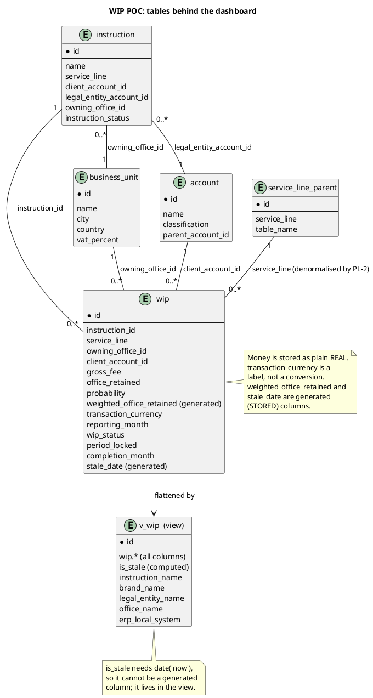

# WIP POC Dashboard

The `Dashboard` tab is the landing screen of the WIP proof-of-concept app
(`POC/wip-poc`). It is the read-only summary of the whole pipeline: seven KPIs
across the top, then three breakdown tables. **Nothing here writes data**, the
billing, losing and period-locking actions live on the `WIP` and `Controls` tabs.

This page documents the app's Dashboard. It is **not** [[Dashboard]], the vault's
own Dataview index.

Everything below is taken from the code (`src/App.svelte`, `src/lib/repo.js`,
`src/lib/schema.js`), which is the source of truth for the app. Where a value is
inferred rather than read directly, it is marked.

## What the dashboard shows

The header's global **reporting-month selector** scopes the whole screen. An empty
selection means *all reporting months*; choosing a month filters the KPI bar and all
three tables to that `reporting_month`. Same `month` state drives the `WIP` tab too.

### 1. KPI bar

Seven tiles, rendered by `KpiBar.svelte` from a single aggregated row
(`repo.getKpis`). In hand, Billed, Paid and Lost are **gross fee** by lifecycle
state; weighted retained is the discounted pipeline.

| Tile | Meaning | Expression |
| --- | --- | --- |
| In hand | Gross WIP not yet billed | `sum(gross_fee)` where `wip_status = 'WIP'` |
| Weighted retained | Pipeline value: retained fee × confidence | `sum(office_retained × probability / 100)` where `WIP` |
| Billed | Gross fee of billed lines | `sum(gross_fee)` where `wip_status = 'Billed'` |
| Paid | Gross fee of paid lines | `sum(gross_fee)` where `wip_status = 'Paid'` |
| Lost | Gross fee of lost lines | `sum(gross_fee)` where `wip_status = 'Lost'` |
| Stale lines | Count of open lines past `stale_date` | `count(is_stale = 1)` |
| Locked lines | Count of lines in a locked period | `sum(period_locked)` |

A **mixed-currency warning** appears under the bar when the loaded rows contain more
than one distinct `transaction_currency`. **It is a text note only**, the sums are not
converted, which is the same reporting gap flagged in [[wip-reporting-and-kpis]]
(the "currency warning" in [[wip-table-specification]]). The warning is computed in
`App.svelte`, not in SQL.

### 2. Totals by status

**One row per lifecycle state, always all four**, a state with no lines renders as a
zero row rather than disappearing (back-filled in `repo.getTotalsByStatus`). Columns:
Status, Lines, Gross, Share, Weighted.

`Share` is the row's gross as a percentage of the whole-scope gross. It is computed in
the component (`TotalsTables.svelte`), not in SQL. The footer row sums the columns.

### 3. Totals by office and Totals by service line

Two group tables from one shape (`GROUP_TOTALS_SQL` in `repo.js`). Each row is one
owning office or one service line, with every lifecycle state side by side. Columns:
Lines, In hand, Billed, Paid, Lost, Weighted.

- **Office**, groups on `office_name` (the `business_unit` name), falling back to
  `'Unknown office'`.
- **Service line**, groups on the denormalised `wip.service_line`, falling back to
  `'Unknown service line'`.
- Ordered by total gross, descending. Footers are summed in the component.

These two dimensions are the POC's answer to the wiki's *"weighted pipeline by
`kf_serviceline`, `kf_owningoffice`"* requirement in [[wip-reporting-and-kpis]],
extended so each group also shows what it has billed and lost, not open WIP only.

### Not on the Dashboard

- **Alerts, receivables ageing buckets and the event log**, these are on the `Controls`
  tab, not here.
- The **WIP table** (searchable, selectable, one line per row) is the `WIP` tab.

## Data structure

Every dashboard query reads the SQLite view **`v_wip`**, never the base tables. The
view flattens the joins so the aggregates can reference bare column names. The grain
of `v_wip` is **one row per WIP line**, with the parent Instruction's and office's
attributes pulled in.



### Columns the dashboard actually reads

| Column | Source | Role in the dashboard |
| --- | --- | --- |
| `wip_status` | `wip` | The lifecycle dimension: WIP / Billed / Paid / Lost |
| `gross_fee` | `wip` | The gross amount summed in the KPI bar and every table |
| `office_retained` | `wip` | Base of the weighted-retained calculation |
| `probability` | `wip` | Discount factor (0–100) for weighted retained |
| `weighted_office_retained` | generated | `office_retained × probability / 100` |
| `reporting_month` | `wip` | The month-scoping filter |
| `period_locked` | `wip` | "Locked lines" count |
| `is_stale` | `v_wip` | "Stale lines" count |
| `office_name` | `business_unit` via view | Office grouping |
| `service_line` | `wip` (denormalised) | Service-line grouping |
| `transaction_currency` | `wip` | Drives the mixed-currency warning |

Two notes on the model:

- **`service_line` on the dashboard comes from `wip`, not from the join to
  `service_line_parent`.** It is copied down from the parent Instruction by trigger
  **PL-2** on insert, which is exactly why the wiki insists PL-2 must be correct.
  If it is wrong, every service-line total here diverges from the CRM of record.
  See [[wip-automation-requirements]] and [[wip-application-composition]].
- **No currency conversion.** `gross_fee`, `office_retained` and the weighted
  aggregate simply sum the stored values. EUR and GBP lines are added together; the
  warning banner is the only signal.

## Queries

Four reads produce the whole screen. All four are defined in `src/lib/repo.js`, and
all four use the same month-scoping idiom: a null binds "all months", because
`? IS NULL OR reporting_month = ?` is passed the same `month` value twice.

### KPI bar: `getKpis(month)`

```sql
SELECT
  round(sum(CASE WHEN wip_status = 'WIP'    THEN gross_fee END), 2)                     AS gross_pipeline,
  round(sum(CASE WHEN wip_status = 'WIP'
                 THEN office_retained * probability / 100.0 END), 2)                    AS weighted_retained,
  round(sum(CASE WHEN wip_status = 'Billed' THEN gross_fee END), 2)                     AS billed,
  round(sum(CASE WHEN wip_status = 'Paid'   THEN gross_fee END), 2)                     AS paid,
  round(sum(CASE WHEN wip_status = 'Lost'   THEN gross_fee END), 2)                     AS lost,
  sum(CASE WHEN is_stale = 1 THEN 1 ELSE 0 END)                                         AS stale_lines,
  sum(period_locked)                                                                    AS locked_lines
FROM v_wip
WHERE ? IS NULL OR reporting_month = ?
```

Returns a single row. `SUM(CASE ...)` per status is the pattern used throughout: one
pass over the view yields every state at once.

### Totals by status: `getTotalsByStatus(month)`

```sql
SELECT wip_status AS status,
       count(*)     AS lines,
       round(sum(gross_fee), 2) AS gross,
       round(sum(CASE WHEN wip_status = 'WIP'
                      THEN office_retained * probability / 100.0 END), 2) AS weighted
  FROM v_wip
 WHERE ? IS NULL OR reporting_month = ?
 GROUP BY wip_status
```

`GROUP BY` only returns states that have lines. The function then re-projects the
fixed list `['WIP', 'Billed', 'Paid', 'Lost']` and substitutes a zero row for any
missing state, so the table shape is stable.

### Totals by office / service line: `getTotalsByOffice` and `getTotalsByServiceLine`

Both call a factory, `GROUP_TOTALS_SQL(dimensionExpr)`, which supplies the one
substitution point:

```sql
SELECT <dimensionExpr>                            AS group_name,
       count(*)                                   AS lines,
       round(sum(CASE WHEN wip_status = 'WIP'    THEN gross_fee END), 2) AS in_hand,
       round(sum(CASE WHEN wip_status = 'Billed' THEN gross_fee END), 2) AS billed,
       round(sum(CASE WHEN wip_status = 'Paid'   THEN gross_fee END), 2) AS paid,
       round(sum(CASE WHEN wip_status = 'Lost'   THEN gross_fee END), 2) AS lost,
       round(sum(CASE WHEN wip_status = 'WIP'
                      THEN office_retained * probability / 100.0 END), 2) AS weighted,
       round(sum(gross_fee), 2)                   AS total
  FROM v_wip
 WHERE ? IS NULL OR reporting_month = ?
 GROUP BY <dimensionExpr>
 ORDER BY total DESC
```

- Office: `<dimensionExpr>` = `COALESCE(office_name, 'Unknown office')`
- Service line: `<dimensionExpr>` = `COALESCE(service_line, 'Unknown service line')`

`COALESCE` guarantees a group key even if the denormalised column is null, so no line
is silently dropped from the totals.

### What is computed in JavaScript, not SQL

- **Share %** on the status table: `round(part / whole * 100)`.
- **All footer totals** on every table: summed client-side over the returned rows.
- **The mixed-currency warning**: distinct `transaction_currency` values across the
  in-memory `rows`.

## Where it lives in the code

| UI element | Component | Repo function | SQL |
| --- | --- | --- | --- |
| KPI tiles + currency note | `KpiBar.svelte` | `getKpis` | above |
| Totals by status | `TotalsTables.svelte` | `getTotalsByStatus` | above |
| Totals by office | `TotalsTables.svelte` | `getTotalsByOffice` | `GROUP_TOTALS_SQL` |
| Totals by service line | `TotalsTables.svelte` | `getTotalsByServiceLine` | `GROUP_TOTALS_SQL` |
| Month selector, tab state | `App.svelte` | n/a | n/a |

All derived reads in `App.svelte` key off a `version` counter; every mutation bumps
it, which re-runs these queries against the live in-memory database. The dashboard is
therefore never stale relative to a create, bill, lose or lock made on another tab.

## Related

- **[[wip-reporting-and-kpis]]**, the reporting requirement the dashboard models
- **[[wip-table-specification]]**, the `kf_WIP` columns behind the view
- **[[wip-automation-requirements]]**, PL-2 (the denormalisation the totals depend on), PL-4
- **[[wip-application-composition]]**, the ArchiMate data model
- **[[wip-open-questions]]**, Q7 (mixed-currency / receivables inference), Q1
