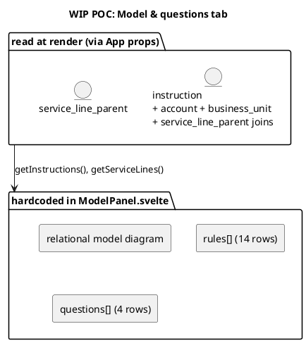

# WIP POC, Model & questions tab

The **Model & questions** tab is the app's self-description. Where the other tabs show data, this one shows the shape of the model and the ground rules the data is held to: the relational structure, the database-enforced rules, the open questions carried over from the wiki, and the live instruction and service-line reference lists. `ModelPanel.svelte` renders it.

This page documents what the tab shows, the reference tables it reads, and the queries behind its two live lists.

## What the tab shows

Two columns. The left column carries the model and the questions; the right column carries the rules and the live reference lists.

**Relational model.** A fixed text diagram of the conceptual model, drawn in the source's `kf_` naming rather than the app's table names. It shows `kf_serviceline` (1) feeding `kf_Instruction` (1), which has many `kf_WIP`; the instruction points at a Legal Entity account and, through `kf_DealProperty`, at `kf_Property`; each WIP line points at a `kf_BusinessUnit` (owning office) and a client brand account, and at a `kf_FeeSchedule` that exists for Capital Markets only. A caption records the two simplifications the POC makes: the thirteen service-line parent tables collapse into one `service_line_parent` table, and the universal property junction is `deal_property`.

**Open questions.** The questions carried from the wiki, each tagged `blocking` or `open`. Four are shown: Q1 (no authoritative source for the local-system reference, stubbed as a WIP field), Q2 (the parent-model rules still describe a retired 13-lookup design), Q3 (staleness has no equivalent in the source platform, so the POC makes it a view column and a UI flag), and Q7 (the receivables KPI references a field that does not exist, so the derivation is inferred).

**Rules enforced by the database.** Fourteen rules in three columns: code, text, and how it is enforced (`trigger`, `check`, or `rule`). The footnote is the point of the panel: these are schema constraints and triggers, not application validations, so they hold no matter which client writes the data. The codes group into the pipeline rules (PL-1 to PL-4), the flow rules (FL-2 to FL-5), the entity check (F5), and the business rules (BR).

**Instructions.** The live instruction list, one row per instruction with its reference, service line, client, and status. Status is shown as a pill coloured by state.

**Service lines.** The live service-line reference list, one tag per row, with a count in the heading.

## Data structure

The model and questions are hardcoded literals in the component. Only the instruction and service-line lists read the database.



The instruction list is a five-table read: the instruction joined to its client account, its legal-entity account, its owning office, and its parent service line. That join is itself a small demonstration of the model, since the flat rows it returns are the same relationships the diagram describes.

### Rules shown

| Code | Rule | Enforced as |
| --- | --- | --- |
| PL-1 | A WIP line must hang off exactly one parent, stamped at creation. | trigger |
| PL-2 | Service line, sector, brand, negotiator, office and VAT are denormalised from the Instruction on create. | trigger |
| PL-3 | Every probability change captures a pre-image before applying. | trigger |
| PL-4 | A locked period rejects edits to fee, probability, status and invoice fields. | trigger |
| FL-2 | Withdrawing an Instruction cascades its open WIP lines to Lost. | trigger |
| FL-3 | A cascade into a closed period is refused rather than silently rewriting history. | trigger |
| FL-4 | The period is locked on the 15th of the following month. | rule |
| FL-5 | Billing from under 30% probability raises a gaming alert. | trigger |
| F5 | The invoice entity must be classified as a Legal Entity. | trigger |
| BR | Status is WIP to Billed to Paid, with Lost. Paid and Lost are terminal. | check |
| BR | Invoice number, due date and ERP reference are required at Billed. | trigger |
| BR | Date paid in full is required at Paid, and the invoice number is never cleared. | trigger |
| BR | Probability freezes the moment status leaves WIP. | trigger |
| BR | Fee schedule is a Capital Markets table and links nowhere else. | trigger |

### Questions shown

| Code | Question | Kind |
| --- | --- | --- |
| Q1 | `kf_fin_localsystemref` has no authoritative source table. Stubbed as a WIP field. | blocking |
| Q2 | PL-1 / FL-2 / FL-3 still describe the retired 13-lookup parent model. | blocking |
| Q3 | Staleness is a business trigger with no Dataverse equivalent; the POC makes it a view column plus a UI flag. | open |
| Q7 | Reporting KPIs reference `kf_Deal.kf_fin_outstanding`, which does not exist. Aged receivables here is an inferred derivation. | blocking |

## Queries

Both lists come from `POC/wip-poc/src/lib/repo.js` and are passed into the component from `App.svelte`.

**`getInstructions()`.** The instruction table joined to the names the panel displays.

```sql
SELECT i.*,
       a.name  AS client_name,
       le.name AS legal_entity_name,
       bu.name AS office_name,
       sl.service_line AS parent_service_line
  FROM instruction i
  JOIN account a  ON a.id  = i.client_account_id
  JOIN account le ON le.id = i.legal_entity_account_id
  JOIN business_unit bu ON bu.id = i.owning_office_id
  JOIN service_line_parent sl ON sl.id = i.parent_id
 ORDER BY i.name
```

**`getServiceLines()`.** The reference list behind the tagged service lines.

```sql
SELECT * FROM service_line_parent ORDER BY service_line
```

## Where it lives

| Panel | Component | Source |
| --- | --- | --- |
| Relational model, rules, questions | `ModelPanel.svelte` | hardcoded literals |
| Instructions | `ModelPanel.svelte` via `App.svelte` | `getInstructions` |
| Service lines | `ModelPanel.svelte` via `App.svelte` | `getServiceLines` |

## Related

- [[dashboard]] and [[wip]], where the rules above are visible in the data.
- [[create]], which writes through the PL-1, PL-2, and F5 triggers listed here.
- [[controls]], which surfaces the FL-5 gaming alert and the FL-4 period lock.
- [[wip-automation-requirements]], the source of the rule set.
- [[wip-open-questions]], the fuller list these questions are drawn from.
