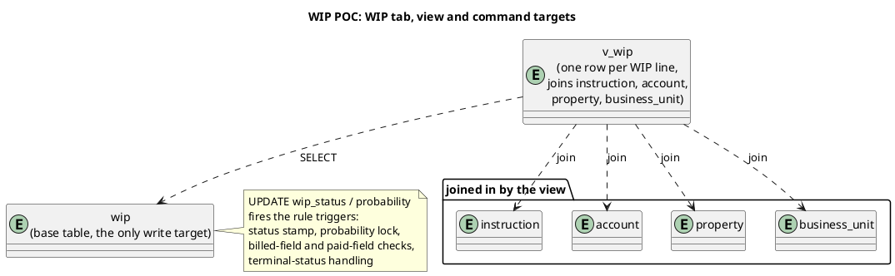

# WIP POC, WIP tab

The **WIP** tab is the working list. It shows every WIP line as a filtered, sortable table, and lets you open one line in a detail drawer to move it through its status lifecycle or change its probability. This is the operational heart of the app: the Dashboard summarises these lines, and the Create tab feeds new ones in.

This page documents what the tab shows, the view and tables behind it, and the queries and commands that drive it.

## What the tab shows

Two components make up the tab. `WipTable.svelte` draws the list and the filter bar. `WipDetail.svelte` draws the selected line in a side drawer. The same `KpiBar` that heads the Dashboard is rendered above the table, so the headline numbers stay visible while you work the list.

**Filter bar.** A free-text search and three selectors.

- Search matches the line name, brand name, or instruction name.
- Office picks a single `business_unit`.
- Status picks a single `wip_status`.
- A stale-only toggle restricts the list to flagged lines.

**The table.** One row per WIP line, ordered with stale lines first. The columns are the fields the operator scans when chasing work.

| Column | Field | Note |
| --- | --- | --- |
| Line | `name` | the WIP reference/name |
| Status | `wip_status` | one of WIP, Billed, Paid, Lost |
| Brand | `brand_name` | flattened from the account join |
| Service line | `service_line` | from the WIP line |
| Office | `office_city` | the owning `business_unit` city |
| Gross | `gross_fee` | |
| Retained | `office_retained` | 20% held by the office |
| Prob | `probability` | 0 to 100, shown with a `%` |
| Weighted | `weighted_office_retained` | `office_retained * probability / 100`, computed in the view |
| Flags | derived | see below |

**Flags.** Up to three pills are appended to a row, all computed from view fields with no extra query.

- `STALE` when `is_stale` is set (the line has sat too long in a non-terminal status).
- `LOCKED` when `period_locked` is set (its reporting period has been closed).
- `NO ERP` when the line is Billed but `erp_local_system_ref` is null, i.e. it was billed without a local-system reference.

**Detail drawer.** Opening a row fetches that single line and shows its facts alongside two actions: a status move (a dropdown of the legal next statuses, plus the extra fields a move may require) and a probability control. Both write straight back and bump the app's version counter so the table, KPIs, and any open panels re-read.

## Data structure

The WIP tab is a pure read-and-command view over `v_wip`. Reads use the view; writes go to the base `wip` table and let triggers do the rest.



The view exposes the flattened labels (`brand_name`, `office_name`, `office_city`, `service_line`, `instruction_name`) alongside the base columns and the derived values such as `weighted_office_retained`, `is_stale`, and the receivable fields used by the Controls tab. Because the tab reads the view, the table and the Dashboard can never disagree about a number.

## Queries and commands

All of the following live in `POC/wip-poc/src/lib/repo.js`.

**`getWip(filters)`.** The list query. Predicates are appended only when the matching filter is set, so an empty filter bar returns every line.

```sql
SELECT * FROM v_wip
[WHERE wip_status = ?]
[  AND owning_office_id = ?]
[  AND (name LIKE ? OR brand_name LIKE ? OR instruction_name LIKE ?)]
[  AND is_stale = 1]
ORDER BY is_stale DESC, name
```

The search predicate binds the same `%term%` value to all three columns. Stale lines sort to the top regardless of the other filters.

**`getWipLine(id)`.** One line for the detail drawer.

```sql
SELECT * FROM v_wip WHERE id = ?
```

**`getOffices()`.** Populates the office selector; the same list the Dashboard office totals use.

**`changeStatus(id, nextStatus, fields)`.** Moves a line to its next status. Only the fields relevant to that transition are written; the rule triggers validate the combination.

```sql
UPDATE wip
   SET wip_status = ?, <transition fields, e.g. invoice_number, invoice_due_date, erp_local_system_ref>
 WHERE id = ?
```

**`updateProbability(id, probability)`.** Adjusts the weight. The probability-lock trigger rejects the write once a line is past the point where probability stops mattering.

```sql
UPDATE wip SET probability = ? WHERE id = ?
```

Because every write is a single `UPDATE` on `wip`, the automation rules (PL-1 to PL-5, BR-1 to BR-3, the status stamps, and the terminal-status handling) all fire from the database rather than from the component. The tab only decides which status and which fields to send.

## Where it lives

| Concern | Component | Repo command |
| --- | --- | --- |
| Filter bar and table | `WipTable.svelte` | `getWip`, `getOffices` |
| Detail drawer, status move | `WipDetail.svelte` | `getWipLine`, `changeStatus` |
| Detail drawer, probability | `WipDetail.svelte` | `updateProbability` |
| Headline KPIs | `KpiBar.svelte`, `TotalsTables.svelte` | `getKpis`, `getTotalsBy*` |

## Related

- [[dashboard]], the summary view over the same `v_wip`.
- [[create]], which writes the first WIP line.
- [[controls]], which ages the Billed lines into receivables buckets.
- [[wip-table-specification]], the column and rule specification behind the view.
