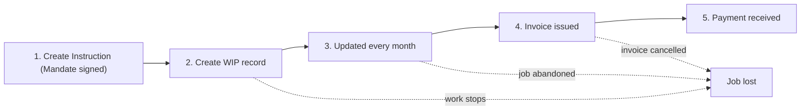

# WIP — Simple Workflow

What happens to a job from start to finish, in plain English. No field names, no
automation IDs, no unresolved questions.

**WIP** = work in progress: work we've done for a client but haven't invoiced yet.

## The flow

## Step by step

1. **Create Instruction** — the mandate is signed and an Instruction is created.
   Nothing is tracked as WIP before this.
2. **Create WIP record** — once the Instruction exists, create the WIP record for
   the job: who the client is, what the fee is, which team is on it.
3. **Updated every month** — the person running the job updates it: how likely it
   is to happen, and what it's worth now. This keeps the pipeline truthful.
4. **Invoice issued** — the work is done, an invoice goes out, and the record is
   marked **Billed**.
5. **Payment received** — the client pays, and the record is closed as **Paid**.

If a job stops partway — the deal falls through, the work is abandoned, or the
invoice is cancelled — the record is marked **Lost** instead.

## The monthly habit

- **Month end** — finance reviews the figures and reports on the pipeline.
- **15th of the following month** — the month's numbers are locked; no more changes.
- **Quiet jobs** — anything that hasn't been updated gets flagged and chased, so
  nothing sits in the pipeline forever.

That's the whole loop. The full detail lives in [[wip-high-level-workflow]].